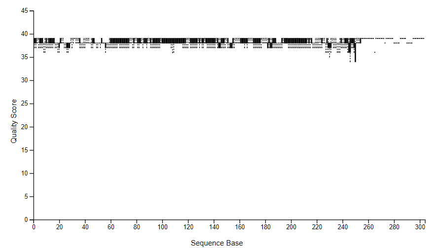

# MICB 475 Team 12: Lab Notebook and Meeting Agenda
This repository stores all the scripts and documentation related to our team's project!

## [The All-Star Team](https://t.ly/wiPSh)

## Summary
This project explores the complex effects of anemia on systemic metabolism and microbial functions, using four main metabolic indicators: **Adjusted Body Iron Storage (BIS) Status** (`adj_bis_status`) - **Adjusted Ferritin Status** (`adj_ferritin_status`) - **Adjusted Retinol Binding Protein (RBP) Status** (`adj_rbp_status`) - **C Reactive Protein (CRP) Status** (`crp_status`). These indicators provide insights into iron metabolism, vitamin A transport, protein synthesis, and metabolic syndrome.

# Table of Contents

1. [Project Aims](#Project-Aims)
2. [Agenda](#Agenda)
3. [Lab Notebook](#Lab-Notebook)
   - [P001: Importing and Demultiplexing the Anemia Dataset](#P001-Importing-and-Demultiplexing-the-Anemia-Dataset)
   - [P002: Generating ASVs](#P002-Generating-ASVs)

# Project Aims
- Aim 1: Microbiome Data Processing: Use Qiime2 for initial microbiome data processing to set the stage for detailed analysis.
- Aim 2: Diversity Analysis: Examine microbial diversity using Qiime or R to identify significant differences related to anemia.
- Aim 3: Targeted Analysis: Focus on interesting findings from the diversity analysis for deeper investigation, potentially expanding to differential abundance analysis.
- Aim 4: Metabolic Pathway Analysis: Use PICRUSt2 for functional analysis to identify metabolic pathways affected by anemia, using server-based and R analyses.
- Aim 5: Development of Predictive Models: Use identified metabolic markers to develop models predicting anemia

# Agenda

### February 14 2024 at 2:15 pm PST
- Provide update of work done so far --> AIM 1: Microbiome Data Processing complete
- Go over relevant questons related to Aim 1 (e.g. training classifiers)
- Clarify research question for project and workflow/aims 
- Next steps: Work towards AIM 2: Diversity Analysis

# Lab Notebook

## P001: Importing and Demultiplexing the Anemia Dataset
**Date:** Feb 9th, 2024

### Purpose

To import and demultiplex the 16S rRNA sequences from the [Anemia Dataset](https://www.ncbi.nlm.nih.gov/pmc/articles/PMC6290362/) using QIIME2.

### Procedure

- Created a dedicated directory for all related analyses related to the dataset: `/data/anemia`.
- Used manifest file (`/mnt/datasets/project_2/anemia/anemia_manifest_updated.txt`) to import and demultiplex dataset.
- Generated a visualization file `demux.qzv`, moved to local computer, and viewed using [QIIME2 View](https://view.qiime2.org/).

### Output Files

- Demultiplexed `.qza` file: `demux_seqs.qza`
  - Path in server: `/data/anemia/demux_seqs.qza`
- Demultiplexed `.qzv` file: `demux.qzv`
  - Path in server: `/data/anemia/demux.qzv`
  - Qzv file also stored in [repository](QIIME_files/demux.qzv)

### Results

- Total number of reads: 6,017,157
- Total number of samples: 193
- Range of sequencing depth: 67-74,453
- Maximum read length (bp): 253
- The minimum sequence length identified during subsampling was 210 bases.

### Sequence Length Statistics

## P002: Generating ASVs 
**Date**: February 11, 2024

### Purpose
To denoise the demux file and group the sequences into amplicon sequence variants (ASVs).

### Procedure
Used the quality score graph visualized using the `demux.qzv` file (generated in P001) to determine an appropriate truncation length for denoising + ASV clustering:

#### ASV Generation (Attempt 1)
We first set the truncation length to 303 nucleotides, as the reads at this length appeared to have a high quality score. However, this resulted in only 10 ASVs and 12 samples. 

#### ASV Generation (Attempt 2)
As a result, we reattempted the denoising using a truncation length of 253 nucleotides since this was the length of ~98% of reads.

**Result**: Successfully generated 1434 ASVs and 193 samples.

### Storage 
#### ASV Generation (Attempt 1: Truncation Length of 303 nt)
- On server, located in `/data/anemia/trunc-len_303`.
- On the repository, the `rep-seqs.qzv` and `table.qzv` files are located in: `QIIME_files/Trunc-length_303`

#### ASV Generation (Attempt 2: Truncation Length of 253 nt)
- On the server, the following files were generated: `rep-seqs.qza`, `rep-seqs.qzv`, `stats.qza`, `stats.qzv`, `table.qza`, `table.qzv` - all stored in `/data/anemia/`.
- On the repository, the `rep-seqs.qzv` and `table.qzv` files are located in: `QIIME_files/Trunc-length_253`

## Taxonomy Analysis

- **Note**: Analysis in progress. Details will be updated upon completion.
