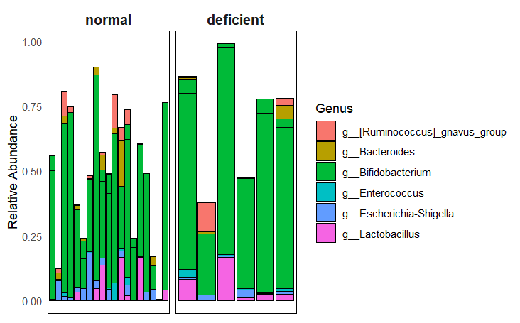

# MICB 475 Team 12: Lab Notebook and Meeting Agenda
This repository contains files related to our project and a lab notebook showing the journey we took in reaching our conclusions. 

## [The All-Star Team](https://t.ly/wiPSh)

## Summary
Iron is an essential micronutrient critical for human growth, cell function, and oxygen transport. Despite its importance, iron deficiency remains a global health issue, particularly in developing countries, leading to conditions such as iron deficiency anemia (IDA). IDA affects about 16% of the world population, especially women and young children, and results from insufficient iron intake and storage. Recent research highlights the role of ferritin, a primary iron storage protein, as an indicator of inflammation, which is influenced by gut microbiome dysbiosis. Studies have shown that gut dysbiosis can impact iron absorption and utilization, contributing to anemia. Conversely, beneficial bacteria like Lactobacillus and Bifidobacterium might enhance iron utilization, suggesting the gut microbiome's potential role in mitigating IDA. Our study focuses on the intricate relationships between anemia, systemic inflammation, and the gut microbiome. We aim to use adjusted ferritin levels to measure inflammation, providing a more accurate assessment of iron status and inflammation in patients. This project seeks to understand how inflammation in anemic infants can alter gut microbial composition and trigger cellular stress responses, offering insights into the systemic effects of anemia and identifying potential microbial targets for therapy. 

**Please note** that, **until** the entry on March 01, we were focusing on looking at four metabolic markers (**Adjusted Body Iron Storage (BIS) Status** (`adj_bis_status`), **Adjusted Ferritin Status** (`adj_ferritin_status`), **Adjusted Retinol Binding Protein (RBP) Status** (`adj_rbp_status`), and **C Reactive Protein (CRP) Status** (`crp_status`)) and how they changed in relation to infection status within the dataset. It is only from March 01 that we started focusing on using Ferritin and examining inflammation levels: 

All scripts run for QIIME processing can be found [here](QIIME_files/QIIME_data_processing_script)

# Table of Contents

1. [Project Aims](#Project-Aims)
2. [Agenda](#Agenda)
3. [Lab Notebook](#Lab-Notebook)
   - [P001: Importing and Demultiplexing the Anemia Dataset](#P001-Importing-and-Demultiplexing-the-Anemia-Dataset)
   - [P002: Generating ASVs](#P002-Generating-ASVs)
   - [P003: Taxonomic Analysis](#P003-Taxonomic-Analysis)
   - [P004: Generating an Alpha Rarefaction Curve](#P004-Genearting-an-Alpha-Rarefaction-Curve)
   - [P005: Creating a Phyloseq Object](#P005-Creating-a-Phyloseq-Object)
   - [P006: Alpha Diversity Analyses in R](#P006-Alpha-Diversity-Analyses-in-R)
   - [P007: Alpha and Beta Diversity Analyses for Infected Students](#P007-Alpha-and-Beta-Diversity-Analyses-for-Infected-Students)
   - [P008: Differential Abundance](#P008-Differential-Abundance)
   - [P009: Core Microbiome](#P009-Core-Microbiome)
   - [P010: Functional Pathways Analysis Custom DESeq2 Function](#P010-Functional-Pathways-Analysis-Custom-DESeq2-Function)
   - [P011: Functional Pathways Analysis](#P011-Functional-Pathways-Analysis)
   - [P012: Enzymatic Pathway Analysis Workflow Using DESeq2 and PICRUSt2](#P012-Enzymatic-Pathway-Analysis-Workflow-Using-DESeq2-and-PICRUSt2)

# Project Aims
- Aim 1: Microbiome Data Processing: Use Qiime2 for initial microbiome data processing to set the stage for detailed analysis.
- Aim 2: Diversity Analysis: Use R to carry out alpha/beta diversity analyses to examine the association between selected metabolic markers (Adjusted Body Iron Storage, Adjusted Ferritin Status, Adjusted Retinol Binding Protein Status, and C Reactive Protein Status) and microbial diversity within 12-month old anemic children
- Aim 3: Infection Status Diversity Metrics: Investigate microbiome differences in anemic children by categorizing each sample as either infected or uninfected, informed by prior evidence suggesting minimal variation across infection stages.
- Aim 4: Targeted Analysis: Focus on the relationship between metabolic markers and microbial abundance/diversity specifically in infected anemic children, expanding to differential abundance analysis afterwards.
- Aim 5: Metabolic Pathway Analysis: Use PICRUSt2 for functional analysis to determine metabolic pathways in anemic children with infection that are influenced by microbiome composition
- Aim 6: Development of Predictive Models: Use identified metabolic markers from anemic children, segmented by infection status, to create predictive models for microbial richness/abundance and potential inflammatory species presence.

# Agenda
### April 10 2024 at 2:15 pm
- Feedback on findings we have? Is there anything we should change?
- Link to PowerPoint presented yesterday: [click here](https://docs.google.com/presentation/d/1Q_2NYI6iRwREKwRISHyYghypWVwosHUD0IXKSO5o_mE/edit?usp=sharing) 
- Link to PowerPoint for figure legends: [click here](https://docs.google.com/presentation/d/1pByYQWFRNFOrJn38CuKmhb83aN2tUKvIWd6hFwwidwE/edit?usp=sharing)   
- Our brains are tired

### April 3 2024 at 2:15 pm
- Review edited figures and figure descriptions [click here](https://docs.google.com/presentation/d/1pByYQWFRNFOrJn38CuKmhb83aN2tUKvIWd6hFwwidwE/edit#slide=id.g2c8ec61cf98_0_172)
- Presentation slides in progress [click here](https://docs.google.com/presentation/d/1Q_2NYI6iRwREKwRISHyYghypWVwosHUD0IXKSO5o_mE/edit#slide=id.g2a14c4a5fd3_0_37) 

### March 27 2024 at 2:15 pm
- Review rough figures + figure legends generated so far [click here](https://docs.google.com/presentation/d/1HTzz5hGxkBD0mtDByJz26Lrisve5_Q5a4xSPshElX1I/edit?usp=sharing)

#### To-Do List

- [x] **Figure 1:**
    - [x] 2 panels, both alpha diversities
    - [x] Kruskal-Wallis test for infection status

- [x] **Figure 2:**
    - [x] Change deficient and normal to deficient levels and normal levels
    - [x] Nonparametric PERMANOVA
    - [x] Beta diversity
    - [x] Insert actual axis line

- [x] **Figure 3:**
    - [x] DSeq - flip the plot

- [x] **Figure 4:**
    - [x] Inflammation vs no inflammation - flip the plot
    - [x] Core microbiome - remove deficient and normal title spacing, expand it width-wise
    - [x] Make relative abundance plot
    - [x] Make it less stringent? (I made it more stringent :) )

- [x] **Figure 5:**
    - [x] PICRUSt, run a p-adjusted and flip it

- [x] **Figure 6:**
    - [x] Flip it so that it's normal vs deficient

- [x] **General Tasks:**
    - [x] Simplify research question
    - [x] Define convalescence in the paper
    - [x] Name of figure should reflect the message of the figure - don't include the methodology
    - [x] Define the use of ferritin 
    - [x] Perform enzyme analysis

### March 20 2024 at 10:15 am
- Go over rough figures generated so far, based on last week's to-do list: [click here](https://docs.google.com/presentation/d/1HTzz5hGxkBD0mtDByJz26Lrisve5_Q5a4xSPshElX1I/edit?usp=sharing)
  
### March 13 2024 at 10:00 am 
- Picrust analysis was done - go over results
- Alpha diversity box plot for adj_ferritin_status (which had significance) was cleaned up for paper
- alpha diversity + anova was conducted on infection status --> resulting box plots were also cleaned up for paper
#### To Do for Next Week:
Figures to do:
1. infected (with 3 stages) do alpha diversity and beta diversity within the 3 stages in anemic patients
2. alpha and beta diversity in just infected anemic patients comparing adj_ferritin_status --> see if there is difference b/w high vs low inflammation
3. do differential abundance 
4. do core microbiome analysis
5. picrust pathway analysis
6. may add in enzymes

### March 06 2024 at 10:00 am 
#### Introduction
- Recap of progress:
  - Conversion of anemia data into a phyloseq object in R.
  - Filtering out missing/NA samples and generating a rarefaction curve.
  - Filtering samples to include only anemic samples, specifically those who are 12 months old.

#### Objective
- Proposal to examine the relationship between metabolic markers and infection status in anemic children.
- Focus on 12-month-old anemic children.
- Investigating whether infected anemic children with markers signaling worse metabolism exhibit higher richness/abundance of inflammatory microbial species compared to those with better metabolism.
- Exploring similar patterns among uninfected anemic children.

#### Proposed Methodology
- Analyzing each metabolic marker individually within anemic children to determine significant differences in alpha/beta diversity.
- Metabolic markers include Adjusted Body Iron Storage (BIS) Status, Adjusted Ferritin Status, Adjusted Retinol Binding Protein (RBP) Status, and C Reactive Protein (CRP) Status.
- Conducting diversity metrics on infection status among anemic children, possibly bypassing this step due to previous findings.
- Grouping all infection statuses together as infected or uninfected.
- Assessing variations in microbial species abundance/diversity across different markers among infected and uninfected anemic children.

#### Data Analysis
- Considering the use of t-tests to evaluate significance for alpha diversity plots.
- Alpha diversity analysis conducted on anemic 12-month-old patients found significance with Shannon diversity for adjusted ferritin status.
- Discussion on parametric vs. non-parametric tests, considering normal distribution.
- Considering non-parametric tests for later analysis.
- Uncertainty regarding performing a t-test on the phylogenetic Faith PD data.

### February 27 2024 at 2:15 pm PST
- Provide update of work done so far --> AIM 1/2: Diversity analysis complete
- Go over relevant questons related to Aim 2 (interpreting p-values)
- Next steps: Work towards AIM 3: Differential Abundance Analysis

### February 14 2024 at 2:15 pm PST
- Provide update of work done so far --> AIM 1: Microbiome Data Processing complete
- Go over relevant questons related to Aim 1 (e.g. training classifiers)
- Clarify research question for project and workflow/aims 
- Next steps: Work towards AIM 2: Diversity Analysis

# Lab Notebook

## P001: Importing and Demultiplexing the Anemia Dataset
**Date:** Feb 9th, 2024

### Purpose

To import and demultiplex the 16S rRNA sequences from the [Anemia Dataset](https://www.ncbi.nlm.nih.gov/pmc/articles/PMC6290362/) using QIIME2.

### Procedure

- Created a dedicated directory for all related analyses related to the dataset: `/data/anemia`.
- Used manifest file (`/mnt/datasets/project_2/anemia/anemia_manifest_updated.txt`) to import and demultiplex dataset.
- Generated a visualization file `demux.qzv`, moved to local computer, and viewed using [QIIME2 View](https://view.qiime2.org/).

### Output Files

- Demultiplexed `.qza` file: `demux_seqs.qza`
  - Path in server: `/data/anemia/demux_seqs.qza`
- Demultiplexed `.qzv` file: `demux.qzv`
  - Path in server: `/data/anemia/demux.qzv`
  - Qzv file also stored in [repository](QIIME_files/demux.qzv)

### Results

- Total number of reads: 6,017,157
- Total number of samples: 193
- Range of sequencing depth: 67-74,453
- Maximum read length (bp): 253
- The minimum sequence length identified during subsampling was 210 bases.

### Sequence Length Statistics

## P002: Generating ASVs 
**Date**: February 11, 2024

### Purpose
To denoise the demux file and group the sequences into amplicon sequence variants (ASVs).

### Procedure
Used the quality score graph visualized using the `demux.qzv` file (generated in P001) to determine an appropriate truncation length for denoising + ASV clustering:

#### ASV Generation (Attempt 1)
We first set the truncation length to 303 nucleotides, as the reads at this length appeared to have a high quality score. However, this resulted in only 10 ASVs and 12 samples. 

#### ASV Generation (Attempt 2)
As a result, we reattempted the denoising using a truncation length of 253 nucleotides since this was the length of ~98% of reads.

**Result**: Successfully generated 1434 ASVs and 193 samples.

### Storage 
#### ASV Generation (Attempt 1: Truncation Length of 303 nt)
- On server, located in `/data/anemia/trunc-len_303`.
- On the repository, the `rep-seqs.qzv` and `table.qzv` files are located in: `QIIME_files/Trunc-length_303`

#### ASV Generation (Attempt 2: Truncation Length of 253 nt)
- On the server, the following files were generated: `rep-seqs.qza`, `rep-seqs.qzv`, `stats.qza`, `stats.qzv`, `table.qza`, `table.qzv` - all stored in `/data/anemia/`.
- On the repository, the `rep-seqs.qzv` and `table.qzv` files are located in: `QIIME_files/Trunc-length_253`

## P003: Taxonomic Analysis
**Date:** Feb 15th, 2024

### Purpose:
To train a classifier to do taxonomic analysis and generate a taxa bar graph

### Procedure:

#### Training our classifier 
1. Extract our amplicon of interest from the reference database `silva-138-99-515-806-nb-classifier.qza` with our desired truncation length of 253.
2. Input sequences from `rep-seqs.qza` generated from P002.
3. Output a trimmed file `ref-seqs-trimmed.qza` which can be found on server `/data/anemia/`.
4. Train classifier with this new `ref-seq-trimmed` file.
5. Input `ref-seqs-trimmed.qza` and compare it to the reference database `silva-138-99-515-806-nb-classifier.qza`.
6. Output trained classifier `classifier.qza` which can be found on server `/data/anemia/`.
7. Use this trained classifier to assign taxonomy to our reads (`rep-seqs.qza`).
8. Input `classifier.qza` along with our reads `rep-seqs.qza`.
9. Output our taxonomy file `taxonomy.qza`.

#### Taxonomic Analysis
1. Convert `taxonomy.qza` to `taxonomy.qzv` for visualization on QIIME2 View.
2. Generate taxonomy bar plot by inputting `table.qza`, `taxonomy.qza`, and `anemia_metadata.txt` files.
3. Visualize the output file `taxa-bar-plots-truncated.qzv` using QIIME2 View which can be found on our server.
   - Server path: `/data/anemia/taxonomy_truncated/taxa-bar-plots-truncated.qzv`
   
*taxa-bar-plots-truncated.qzv - Taxonomy Level 3*

## P004: Generating an Alpha Rarefaction Curve
**Date:** Feb 17th, 2024

### Purpose: 
To filter out mitochondria and chloroplast features and generate an alpha rarefaction curve

### Procedure:

1. Filter out mitochondria and chloroplast from our `table.qza` (from P002) to generate a filtered `table-no-mitochondria-no-chloroplast.qza` table.
2. Convert this file to `table-no-mitochondria-no-chloroplast.qzv` for visualization on QIIME2 view.
3. Generate a tree for phylogenetic diversity analyses using the `rep-seqs.qza` (from P002). Output files `aligned-rep-seqs.qza`, `masked-aligned-rep-seqs.qza`, `unrooted-tree.qza`, and `rooted-tree.qza` can be found on server `/data/anemia/`.
4. Rarefy data to a depth of 50,000 using `table.qza`, the `rooted-tree.qza` that was generated, and `anemia_metadata.txt` metadata file.
   - This depth was chosen because this value lies close to the max frequency per sample (58,297) observed in the table summary (from P002). This will allow us to clearly identify where the curve plateaus.
5. The generated alpha rarefaction curve file `alpha-rarefaction.qzv` can be found in our server: `/data/anemia`.

*alpha_rarefaction.qzv*

## P005: Creating a Phyloseq Object
**Date:** Feb 28th, 2024

### Purpose: 
To create a Phyloseq object from our dataset to carry out alpha/beta diversity analysis in R and for future downstream analysis (such as differential abundance).

### Procedure:

**Loaded Data:**
1. Metadata, OTU table, taxonomy, and phylogenetic tree data were read from their respective files.

**Formatting Loaded Data:**
1. The OTU table was transformed into a matrix format: OTU IDs were set as row names and were converted into phyloseq class using the `otu_table` function.
2. Sample Metadata was converted into a data frame. Sample IDs were set as row names and the data was converted into phyloseq class using the `sample_data` function.
3. Taxonomic strings in the taxonomy file were parsed to separate taxonomic ranks into individual columns, and converted into a matrix format, and feature IDs (OTU IDs) were set as row names.
4. A taxonomy class object suitable for use in phyloseq was created using the `tax_table` function.

**Created Phyloseq Object:**
1. The formatted OTU table, sample metadata, taxonomy table, and phylogenetic tree were combined into a single phyloseq object using the `phyloseq` function.
2. This phyloseq object contains all the necessary data for downstream analysis.

**Analyzed Data:**
1. Mitochondrial and chloroplast sequences were filtered out from the dataset.
2. OTUs with low total counts across all samples (less than 5 counts) were removed.
3. Samples with less than 100 reads were excluded.
4. Samples where data was missing or NA in metadata fields were filtered out.
5. The dataset was subsetted to include **only samples from individuals with anemia**.
6. Further subsetted the dataset to include only samples from 12-month-old infants.
7. Rarefied the 12-month samples to a uniform depth of 10,000 reads per sample, based on previous qzv analysis (P002).

**Saved Results:**
- All R files are stored under `Phyloseq_Files`.
- The **R Script** is here: `Phyloseq_Files/phyloseq_object.R`
- The filtered and processed data were saved as RData files for future use.
- The 12-month-old anemic data before rarefication are stored under: `Phyloseq_Files/12M_anemia_final.RData`.
- The rarefied RData is stored under: `Phyloseq_Files/anemia_rare.RData`.
  
## P006: Alpha Diversity Analyses in R
**Date:** Feb 28th, 2024
### Purpose: 
To conduct richness and diversity analyses on the various indicators for metabolism using the anemia_rare.RData file from P006.

### Load in RData
- Loaded previously saved RData files containing processed data:
  - "12M_anemia_final.RData", containing filtered and processed data specific to 12-month-old infants **with anemia**.
  - "anemia_rare.RData", containing the rarefied "12M_anemia_final.RData" for analysis
                 - this is the file we'll be focusing on

### Alpha Diversity Analysis
1. **Performed Alpha Diversity Analysis:**
  - Calculated and visualized alpha diversity metrics using the 12M_anemia_final.RData.
  - Visualized richness of microbial communities using a richness plot generated with the `plot_richness()` function.
  - Generated richness plot with additional alpha diversity metrics, including Shannon diversity and Chao1 estimator.
  - Customized a richness plot to include the adjusted body iron storage as a factor, using the `adj_bis_status` variable.
  - Saved the customized richness plot as an image file named "plot_richness.png" in: `R_Scripts_files/Alpha_Diversity_Plots/adj_bis_status/plot_richness.png`.
    

 - **Estimated Richness:**
  - Estimated the richness of microbial communities using the rarefied data.
  - This estimation provides insights into the total number of different microbial taxa present in the samples.

### Phylogenetic Diversity Analysis
2. **Calculated Phylogenetic Diversity:**
  - Computed Faith's phylogenetic diversity (PD) using the rarefied data and the associated phylogenetic tree.
  - Calculated phylogenetic distances among samples using the `pd()` function.
  - Added PD values to the sample metadata table under the column named "PD".
- **Plotted Phylogenetic Diversity Against Metadata:**
  - Plotted phylogenetic diversity (PD) against the adjusted body iron storage status to explore its relationship.
  - Generated a boxplot to visualize the distribution of PD across different levels of adjusted body iron storage.
  - Customized the plot with appropriate axis labels.
  - Saved the customized plot of phylogenetic diversity against adjusted body iron storage as an image file named "phylogeny_plot(Faith's).png" in : `R_Scripts_files/Alpha_Diversity_Plots/adj_bis_status/phylogeny_plot(Faith's).png`.
    .png)
3. Repeated the same process (steps 1 and 2) for `adj_bis_status`, `adj_ferritin_status`, `adj_rbp_status`, `infection_status` , and `crp_status` --> plots can be found in: `R_Scripts_files/Alpha_Diversity_Plots`

**R-Script for diversity is here**: `R_Scripts_files/alpha_diversity_Rscript.r`
**R-Script for Infection Status is here**: `R_Scripts_files/infected_stage_anemia_comparison_alpha_diversity.R`
### Results:
- No significant difference in alpha diversity found within any of the metabolic indicators and in infection status **EXCEPT** for `adj_ferritin_status` (p value = 0.03724) - found [here](R_Scripts_files/Alpha_Diversity_Plots/adj_ferritin_status/adj_ferritin_status_t_test_richness.png)
  
- No significant difference between different stages of infection:
  

### Moving forward:
- Due to the lack of alpha diversity between each infection status (Incubation, early convalescence, and late convalescence), we can group all infection stages into one “Infected” category for the beta diversity analysis.
- Since adj_ferritin status had a significant difference, perhaps we can focus on it instead, and now, instead of looking at metabolic markers, we can look at inflammation with ferritin as a marker of this. To do this, ferritin levels (adj_ferritin_status) can be reclassified, with normal levels classified as high inflammation and deficient levels classified as low inflammation. 

## P007: Alpha and Beta Diversity Analyses for Infected Students
**Date: March 1st**
### Purpose: 
To group anemic samples into those who are only infected and redo Shannon alpha diversity analysis (and conduct beta diversity analysis) on adjusted ferritin status. 

### Procedure
- Script for parts A-C found [here](R_Scripts_files/infected_anemia_rare_alpha_diversity.R)

**A. Loading and Preparing Data**
1. **Load Data**: Begin by loading the dataset from "anemia_rare.RData".
2. **Modify Sample Data**:
   - Access the sample data from the phyloseq object.
   - Create a new column `infection_status_updated` to classify participants as "Infected" or "Normal" based on their existing infection status.
   - Update the phyloseq object with the new sample data.
   - Filter the dataset to include only samples classified as "Infected".

**B. Phylogenetic Diversity Analysis**
1. **Calculate Faith's Phylogenetic Diversity**:
   - Compute Faith's PD and add it to the metadata table for further analysis.

**C. Statistical Analysis of Alpha Diversity**
1. **Extract Data for Analysis**:
   - Estimate richness using Shannon and Chao1 indices and combine this with sample data.
2. **Visualize Alpha Diversity**:
   - Generate box plots to visualize alpha diversity measures (Shannon and Chao1) by adjusted ferritin status.
   - Perform Wilcoxon Rank Sum tests to compare alpha diversity indices between groups with different ferritin statuses.
3. **Enhanced Plotting**:
   - Enhance the alpha diversity plots by adding significance labels, adjusting axis properties, and incorporating error bars for visual clarity.

**D. Beta Diversity Analysis** (script found [here](R_Scripts_files/beta_diversity/beta_diversity.R))
1. **Compute Distance Matrices**:
   - Calculate Bray-Curtis and Weighted Unifrac distance matrices.
2. **Principal Coordinates Analysis (PCoA)**:
   - Perform PCoA for both Bray-Curtis and Weighted Unifrac distances.
3. **Visualization**:
   - Plot the ordination results to visualize the beta diversity, and coloring points by adjusted ferritin status to examine patterns.
   - Utilize titles and labels to delineate different analyses and results.
4. **Statistical Testing**:
   - Conduct Wilcoxon tests on the distance matrices to assess differences in microbial community composition related to ferritin status.

**Results:**

- Alpha Diversity
  Surprisingly, adjusted ferritin status showed no significant difference in Alpha diversity in only Infected Patients.
-  
  
- Beta Diversity - all plots can be found [here](R_Scripts_files/Beta_Diversity_Plots):
  Weighted Unifrac analysis and a resulting PCoA plot demonstrated that there was no significant difference between low and high inflammation anemic infants (no significance detected)
  - Weighted Unifrac PCoA Plot:
- 

With special collaboration from Hochschule Osnabrück

**Discussion**
- The absence of a significant difference, which contradicts results from P007, that demonstrated an association between inflammation and alterations in the gut microbiota, is intriguing. This discrepancy could be due to the gut microbiome's functional redundancy, where various microbes might perform similar functions to preserve stability amid pathophysiological changes. Another factor could be the lack of detailed information on the type of infection affecting anemic infants, as this is not clearly specified in the metadata, limiting the conclusions that can be drawn from the non-significant results. Moreover, the small number of anemic infants in the incubation stage of infection (n = 2) restricts the generalizability and representativeness of the findings.

## P008: Differential Abundance
**Date: March 6th**
### Purpose:
- Analyze and document the differential expression of microbial genera in the gut microbiomes of anemic infants, focusing on any inflammation-induced shifts
### Procedure (script found [here](R_Scripts_files/DESeq.R)):
1. **Load Data**:
   - Load the dataset from "12M_anemia_final.RData".
2. **Modify Sample Data**:
   - Access and update the sample data from the phyloseq object `TwelveM_anemia`.
   - Create a new column `infection_status_updated` to categorize participants as either "Infected" or "Normal" based on their infection status.
   - Update this classification in the phyloseq object.
   - Filter the dataset to retain only samples labeled as "Infected".

#### Differential Expression Analysis with DESeq2
1. **Prepare Data for DESeq2**:
   - Convert the filtered phyloseq object to a DESeq2 dataset, considering `adj_ferritin_status` as a variable.
2. **Run DESeq Analysis**:
   - Execute differential expression analysis using DESeq2, setting 'deficient' as the reference group for the `adj_ferritin_status` contrast.
   - View the results table for detailed inspection of the outcomes.

#### Visualization and Interpretation
1. **Generate Volcano Plot**:
   - Plot the effect size versus significance (p-value) using a volcano plot format, highlighting significant changes.
   - Modify the dataset to exclude NA values for clarity in the plot.
   - Customize the plot with color coding to distinguish significant results, and annotate axes and legend for clarity.
2. **Identify Significant ASVs**:
   - Filter for ASVs that show significant adjusted p-values and large fold changes.
   - Prune the phyloseq object to include only these significant ASVs.
   - Prepare a detailed dataset of significant ASVs for further analysis.

#### Bar Plot of Significant Results
1. **Prepare Data**:
   - Convert taxonomy data to a data frame, join with the significant results, and sort based on log2 fold change.
   - Clean the dataset by filtering out entries with undefined genus names.
2. **Create Bar Plot**:
   - Generate a bar plot representing the log2 fold change of significant ASVs categorized by genus.
   - Use error bars to depict the variability and fill color to indicate upregulation or downregulation.
   - Customize the plot's aesthetic elements such as text angles, legend positioning, and grid visibility for enhanced readability.
  
### Results:
- From our volcano plot, it appeared that 20 genera showed significant fold changes in expression
   - 
- Of these 19 genera showed significant upregulation (p < 0.01) in infected anemic infants with high inflammation levels.
  - Bifidobacterium was significantly downregulated (p < 0.01) in the same group.
  -  
- These results indicate a substantial shift in microbial composition due to inflammation in the gut environment.

### Discussion:
- Bifidobacterium was uniquely downregulated compared to other genera that were significantly upregulated in infants with high inflammation.
  - Known for its anti-inflammatory properties, the decline of *Bifidobacterium* may indicate a shift towards a pro-inflammatory state in the gut environment of infected infants.
  - This reduction in Bifidobacterium could exacerbate inflammatory processes, potentially contributing to a more hostile gut environment.

## P009: Core Microbiome
**Date: March 13th**
### Purpose: 
- To identify specific microbial taxa associated with inflammation levels through a core microbiome analysis

**Procedure** (full script found [here](R_Scripts_files/coremicrobiome.R))
#### Setup and Data Preprocessing
1. **Loading Data**:
   - Load the dataset from "12M_anemia_final.RData".
2. **Modify and Update Sample Data**:
   - Access the sample data from the phyloseq object `TwelveM_anemia`.
   - Introduce a new column `infection_status_updated` to categorize participants as "Infected" or "Normal" based on predefined infection status categories.
   - Update the phyloseq object to reflect these changes.
   - Retain only samples labeled as "Infected" for further analysis.

#### Core Microbiome Analysis
1. **Data Transformation**:
   - Convert counts to relative abundance for the filtered dataset.
2. **Subsetting Data by Ferritin Status**:
   - Further subset data by `adj_ferritin_status` to separate groups into "normal" and "deficient".
3. **Identify Core Microbiota**:
   - Determine core microbiota members in each subset based on a prevalence threshold of 70% and a detection limit of zero.
4. **Visualization of Core ASVs**:
   - Generate bar plots to display the relative abundance of ASVs in each subset, enhancing the plots with aesthetic adjustments for clarity and readability.

#### Comparative Analysis Using Venn Diagrams
1. **Identify and Visualize Overlapping and Unique ASVs**:
   - Extract lists of core members for both "normal" and "deficient" groups using the same thresholds.
   - Use a Venn diagram to visualize ASVs shared between or unique to each ferritin status group, with adjustments to accommodate long set labels.
### Taxonomic Analysis of Unique and Common ASVs
1. **Extract Unique and Common ASVs**:
   - Identify ASVs unique to each group and those shared between groups.
2. **Retrieve Taxonomic Information**:
   - Prune the phyloseq object to include only these specific ASVs and convert their taxonomic data into data frames for easier manipulation.
3. **Prepare and Visualize Data**:
   - Label each taxon with its corresponding group status (unique or common).
   - Combine all taxonomic data into a single data frame to facilitate comprehensive analysis and visualization.

#### Results
- **Graph of relative abundance** (note that normal = high inflammation and deficient = low inflammation)
- 
- **Venn Diagram of Core Taxa**
- 
- Identified three ASVs unique to low inflammation status, present in at least 70% of the samples.
- Found two ASVs unique to high inflammation status.
- Noted four shared ASVs, indicating some similarity in microbial composition between both conditions.
- **Table of Identified Core Taxa**
- 

  - **Low Inflammation Condition:**
  - Associated exclusively with *Lactobacillus mucosae* and an unclassified species within the *Enterococcus* genus.
  - Characterized by the presence of *Bifidobacterium bifidum*.

- **High Inflammation Condition:**
  - Marked by an uncharacterized species within the *Faecalibacterium* and *Blautia* genera.

- **Shared Taxa Between High and Low Inflammation:**
  - Includes *Bacteroides fragilis*, *Ruminococcus gnavus*, and a species within the *Escherichia-Shigella* genus.
  - An undefined species within the *Bifidobacterium* genus is also common to both conditions.

 #### Discussion
 - Core microbiome analysis identified:
  - **Unique to low inflammation:**
    - Lactobacillus
    - Enterococcus
    - Bifidobacterium
      - Known for probiotic and anti-inflammatory properties.
  - **Unique to high inflammation:**
    - Faecalibacterium
    - Blautia
      - Known for anti-inflammatory properties and butyrate production.
- Butyrate's role:
  - Inhibits pro-inflammatory immune cells.
  - Activates anti-inflammatory immune cells.
  - Suggests that high inflammation promotes growth of beneficial bacteria to counteract inflammation.

 ## P010: Functional Pathways Analysis Custom DESeq2 Function

### Custom DESeq2 Function for Differential Expression Analysis

### Purpose
This custom R function, `DEseq2_function`, performs differential expression analysis using the DESeq2 package. It is specifically designed to analyze pathway data related to specific conditions or groups in a study. The function takes two main inputs: a filtered abundance table of pathways and corresponding metadata. 

### Inputs
1. **Abundance Table**:
   - A filtered abundance table where pathways are listed in the first column, and no row names are present. This table should include sample data with corresponding pathway abundance values.
2. **Metadata**:
   - Filtered metadata that aligns with the samples in the abundance table. This metadata should indicate the group or condition each sample belongs to.

### Parameters
- `abundance_table`: The table containing pathway abundance data for each sample.
- `metadata`: The metadata associated with each sample, indicating group or condition.
- `col_of_interest`: The specific column in the metadata that defines the groups for comparison in the DESeq2 analysis.

### Function Details
1. **Preparation of Data**:
   - Convert the first column of the abundance table into row names, effectively setting pathways as row identifiers.
   - Adjust the metadata to rename the column of interest to a standard format ("Group_group_nonsense") for consistency in the DESeq2 analysis.

2. **Group Combination and Analysis**:
   - Generate all possible pairwise combinations of groups from the metadata for differential expression analysis.
   - For each combination:
     - Subset the abundance data and metadata to include only samples from the selected groups.
     - Round the abundance data to ensure it is suitable for count-based analysis in DESeq2.
     - Construct a DESeq2 dataset object using the subset data and a model design based solely on the group.
     - Estimate size factors and execute the DESeq2 analysis, obtaining results for each group comparison.

3. **Result Compilation**:
   - Collect and format the results from all comparisons into a comprehensive data frame, providing a clear overview of differential expression across different group comparisons.

### Usage
To use this function:
- Ensure your metadata and abundance data are correctly formatted and aligned.
- Call the function with the abundance table, metadata, and the specific metadata column you are interested in analyzing.

## P011: Functional Pathways Analysis 

 ### Procedure (Script found [here](Functional_Analysis/Picrust_Analysis_adj_ferritin_status/Picrust_Analysis_Ferritin.R)):
 #### Initial Setup and Data Loading
1. **Load Required Libraries**: Import all necessary R libraries including `tidyverse`, `DESeq2`, and `ggpicrust2` for data manipulation and analysis.
2. **Import Metadata**:
   - Load metadata from "anemia_metadata.txt".
   - Filter metadata to include only participants identified as anemic and then further to those labeled as "Infected".

#### Data Import and Preprocessing
1. **Load Pathway Abundance Data**:
   - Import pathway abundance data from "pathway_abundance.tsv".
   - Ensure the data frame contains correct column names and is free from white spaces.
2. **Filter and Clean Data**:
   - Match and filter abundance data to include only samples present in the filtered metadata.
   - Remove samples with no pathway data and ensure correct formatting for downstream analysis.

#### Differential Abundance Analysis (DAA)
1. **Prepare Metadata for DESeq2**:
   - Relevel `adj_ferritin_status` in metadata to set 'normal' as the reference group.
2. **Perform DAA**:
   - Execute pathway differential abundance analysis using the DESeq2 method.
   - Annotate pathways to provide descriptive names instead of cryptic IDs.
3. **Filter Results for Significance**:
   - Extract features with significant p-values (less than 0.05) and prepare them for further analysis and visualization.

#### Visualization of Pathway Analysis
1. **Prepare Data for Visualization**:
   - Match significant pathways with their descriptions for clear labeling.
   - Adjust data tables to focus only on significant pathways and associated metadata.
2. **Generate Heatmap**:
   - Create a heatmap to visualize patterns and differences in pathway activity across samples grouped by adjusted ferritin status.

#### Custom Analysis with Updated DESeq2 Function
1. **Custom DESeq2 Analysis**:
   - Load a custom DESeq2 function tailored for this dataset.
   - Run the function to calculate log2 fold changes and other statistics for pathways.
2. **Bar Plot of Significant Pathways**:
   - Filter the results to focus on significantly altered pathways.
   - Visualize these pathways using a bar plot that highlights differences in log2 fold changes and significance levels.
   
#### Results
- **Heatmap of Pathway Activity**
- 
- No particulary notable patterns observed from heatmap of pathway activity 
- **Log2 fold change Bar Plot**
- 
- All signficant pathways were upregulated in infants with high inflammation levels

#### Discussion

- **From Log2 Fold Change Bar Plot**:
  - The top 3 upregulated pathways were all degradation pathways. This finding suggests a metabolic adaptation where degradation processes are enhanced.
  - This upregulation may indicate the need to meet the increased energy demands associated with high inflammation, potentially to fuel the immune response. Such adaptations could be crucial for the body's ability to manage and respond to inflammatory conditions effectively.

  
## P012 Enzymatic Pathway Analysis Workflow Using DESeq2 and PICRUSt2

### Procedure (Script found [here](Functional_Analysis/Picrust_Analysis_Enzymes/Picrust_Analysis_Enzymes.R)):
#### Initial Setup and Data Loading
1. **Load Required Libraries**: Import necessary R libraries including `readr`, `tidyverse`, `DESeq2`, and `ggpicrust2` for data handling, analysis, and visualization.
2. **Metadata Importation**:
   - Load metadata from "anemia_metadata.txt".
   - Filter metadata to retain only participants identified as anemic and then further to those classified as "Infected".

#### Data Import and Preparation
1. **Load Enzyme Abundance Data**:
   - Import enzyme abundance data from "ec_metagenome.tsv", ensuring it is properly formatted and trimmed of whitespace.
2. **Data Cleaning and Filtering**:
   - Filter metadata to exclude any entries with missing values for the column of interest (e.g., adjusted ferritin status).
   - Match and retain abundance data for samples present in the filtered metadata.
   - Ensure the abundance data is appropriately filtered and cleaned for subsequent analysis, including removing any samples with no data.

#### Differential Abundance Analysis (DAA)
1. **Setup for DESeq2 Analysis**:
   - Relevel the `adj_ferritin_status` in metadata to set a specific group (e.g., 'deficient') as the reference for comparisons.
   - Prepare the abundance data by setting pathways as rownames and ensuring all entries are properly formatted for DESeq2.
2. **Perform DAA**:
   - Execute differential abundance analysis using DESeq2, focusing on pathways.
   - Annotate pathways with descriptive labels instead of cryptic identifiers for clarity.
3. **Results Filtering**:
   - Filter the analysis results to identify features with significant p-values and notable log2 fold changes for detailed investigation.

#### Visualization and Further Analysis
1. **Data Preparation for Visualization**:
   - Adjust the abundance data and results to label pathways by their descriptions for more intuitive understanding.
   - Prepare data subsets focusing on significant and biologically relevant changes.
2. **Generate Visualizations**:
   - Create a heatmap to display patterns of enzyme pathway activity across different groups.
   - Perform PCA to explore the variance and clustering of samples based on pathway activity.
   - Develop a bar plot to visually represent the log2 fold changes of significant pathways, enhancing understanding of the impact of conditions on enzyme levels.

#### Integrating Custom DESeq2 Function
1. **Custom Function Usage**:
   - Load and apply a custom DESeq2 function designed for tailored analysis, ensuring it uses the updated and relevant metadata.
   - Run the function to obtain refined results based on specific analytic criteria, such as significance thresholds and fold change magnitudes.
2. **Results Refinement and Plotting**:
   - Filter results to focus on the most significant and impactful pathways.
   - Order results by log2 fold change and plot them to highlight the most influential enzyme pathways under study conditions.

### Results
- **Log2 fold change Bar Plot**
- 
- All signficant enzymes were upregulated in infants with high inflammation levels
- Only Enzymes with a log2 fold change>4 shown

### Discussion
- The most upregulated enzyme Gamma-L-glutamyl-butirosin B gamma-glutamyl cyclotransferase is involved in the biosynthesis of butirosin B, an aminoglycoside antibiotic that combats a wide range of bacterial infections
- The heightened activity of this cyclotransferase in bacteria can be indicative of a response toward countering inflammatory processes and infection
- The upregulation of the ATPase enzyme might be indicative of an attempt to meet the high ATP demand characteristic of inflammatory states

### Conclusion
This workflow provides a comprehensive approach to analyzing enzyme pathway activity in an anemia study using advanced bioinformatics tools like DESeq2 and PICRUSt2. It includes detailed steps from data preparation to in-depth analysis and visualization, aimed at uncovering significant biological insights related to adjusted ferritin status in anemic patients.

