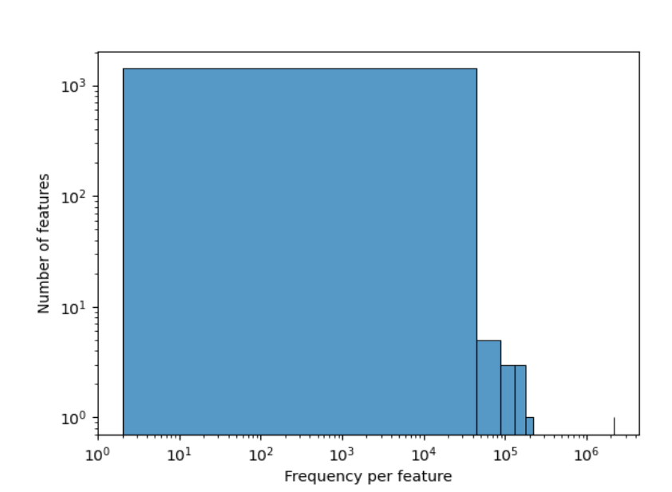

# MICB 475 Team 12: Lab Notebook and Meeting Agenda
This repository stores all the scripts and documentation related to our team's project!

## [The All-Star Team](https://t.ly/wiPSh)

## Summary
This project explores the complex effects of anemia on systemic metabolism and microbial functions, using four main metabolic indicators: **Adjusted Body Iron Storage (BIS) Status** (`adj_bis_status`), **Adjusted Ferritin Status** (`adj_ferritin_status`), **Adjusted Retinol Binding Protein (RBP) Status** (`adj_rbp_status`), and **C Reactive Protein (CRP) Status** (`crp_status`). These indicators provide insights into iron metabolism, vitamin A transport, protein synthesis, and metabolic syndrome.

All scripts run for QIIME processing can be found [here](QIIME_files/QIIME_data_processing_script)

# Table of Contents

1. [Project Aims](#Project-Aims)
2. [Agenda](#Agenda)
3. [Lab Notebook](#Lab-Notebook)
   - [P001: Importing and Demultiplexing the Anemia Dataset](#P001-Importing-and-Demultiplexing-the-Anemia-Dataset)
   - [P002: Generating ASVs](#P002-Generating-ASVs)
   - [P003: Taxonomic Analysis](#P003-Taxonomic-Analysis)
   - [P006: Creating a Phyloseq Object](#P006-Creating-a-Phyloseq-Object)
   - [P007: Alpha Diversity Analyses in R](#P007-Alpha-Diversity-Analyses-in-R)

# Project Aims
- Aim 1: Microbiome Data Processing: Use Qiime2 for initial microbiome data processing to set the stage for detailed analysis.
- Aim 2: Diversity Analysis: Examine microbial diversity using Qiime or R to identify significant differences related to anemia.
- Aim 3: Targeted Analysis: Focus on interesting findings from the diversity analysis for deeper investigation, potentially expanding to differential abundance analysis.
- Aim 4: Metabolic Pathway Analysis: Use PICRUSt2 for functional analysis to identify metabolic pathways affected by anemia, using server-based and R analyses.
- Aim 5: Development of Predictive Models: Use identified metabolic markers to develop models predicting anemia

# Agenda

### March 04 2024 at 10:00 am 
#### Introduction
- Recap of progress:
  - Conversion of anemia data into a phyloseq object in R.
  - Filtering out missing/NA samples and generating a rarefaction curve.
  - Filtering samples to include only anemic samples, specifically those who are 12 months old.

#### Objective
- Proposal to examine the relationship between metabolic markers and infection status in anemic children.
- Focus on 12-month-old anemic children.
- Investigating whether infected anemic children with markers signaling worse metabolism exhibit higher richness/abundance of inflammatory microbial species compared to those with better metabolism.
- Exploring similar patterns among uninfected anemic children.

#### Proposed Methodology
- Analyzing each metabolic marker individually within anemic children to determine significant differences in alpha/beta diversity.
- Metabolic markers include Adjusted Body Iron Storage (BIS) Status, Adjusted Ferritin Status, Adjusted Retinol Binding Protein (RBP) Status, and C Reactive Protein (CRP) Status.
- Conducting diversity metrics on infection status among anemic children, possibly bypassing this step due to previous findings.
- Grouping all infection statuses together as infected or uninfected.
- Assessing variations in microbial species abundance/diversity across different markers among infected and uninfected anemic children.

#### Data Analysis
- Considering the use of t-tests to evaluate significance for alpha diversity plots.
- Alpha diversity analysis conducted on anemic 12-month-old patients found significance with Shannon diversity for adjusted ferritin status.
- Discussion on parametric vs. non-parametric tests, considering normal distribution.
- Considering non-parametric tests for later analysis.
- Uncertainty regarding performing a t-test on the phylogenetic Faith PD data.

### February 27 2024 at 2:15 pm PST
- Provide update of work done so far --> AIM 1/2: Diversity analysis complete
- Go over relevant questons related to Aim 2 (interpreting p-values)
- Next steps: Work towards AIM 3: Differential Abundance Analysis

### February 14 2024 at 2:15 pm PST
- Provide update of work done so far --> AIM 1: Microbiome Data Processing complete
- Go over relevant questons related to Aim 1 (e.g. training classifiers)
- Clarify research question for project and workflow/aims 
- Next steps: Work towards AIM 2: Diversity Analysis

# Lab Notebook

## P001: Importing and Demultiplexing the Anemia Dataset
**Date:** Feb 9th, 2024

### Purpose

To import and demultiplex the 16S rRNA sequences from the [Anemia Dataset](https://www.ncbi.nlm.nih.gov/pmc/articles/PMC6290362/) using QIIME2.

### Procedure

- Created a dedicated directory for all related analyses related to the dataset: `/data/anemia`.
- Used manifest file (`/mnt/datasets/project_2/anemia/anemia_manifest_updated.txt`) to import and demultiplex dataset.
- Generated a visualization file `demux.qzv`, moved to local computer, and viewed using [QIIME2 View](https://view.qiime2.org/).

### Output Files

- Demultiplexed `.qza` file: `demux_seqs.qza`
  - Path in server: `/data/anemia/demux_seqs.qza`
- Demultiplexed `.qzv` file: `demux.qzv`
  - Path in server: `/data/anemia/demux.qzv`
  - Qzv file also stored in [repository](QIIME_files/demux.qzv)

### Results

- Total number of reads: 6,017,157
- Total number of samples: 193
- Range of sequencing depth: 67-74,453
- Maximum read length (bp): 253
- The minimum sequence length identified during subsampling was 210 bases.

### Sequence Length Statistics

## P002: Generating ASVs 
**Date**: February 11, 2024

### Purpose
To denoise the demux file and group the sequences into amplicon sequence variants (ASVs).

### Procedure
Used the quality score graph visualized using the `demux.qzv` file (generated in P001) to determine an appropriate truncation length for denoising + ASV clustering:

#### ASV Generation (Attempt 1)
We first set the truncation length to 303 nucleotides, as the reads at this length appeared to have a high quality score. However, this resulted in only 10 ASVs and 12 samples. 

#### ASV Generation (Attempt 2)
As a result, we reattempted the denoising using a truncation length of 253 nucleotides since this was the length of ~98% of reads.

**Result**: Successfully generated 1434 ASVs and 193 samples.

### Storage 
#### ASV Generation (Attempt 1: Truncation Length of 303 nt)
- On server, located in `/data/anemia/trunc-len_303`.
- On the repository, the `rep-seqs.qzv` and `table.qzv` files are located in: `QIIME_files/Trunc-length_303`

#### ASV Generation (Attempt 2: Truncation Length of 253 nt)
- On the server, the following files were generated: `rep-seqs.qza`, `rep-seqs.qzv`, `stats.qza`, `stats.qzv`, `table.qza`, `table.qzv` - all stored in `/data/anemia/`.
- On the repository, the `rep-seqs.qzv` and `table.qzv` files are located in: `QIIME_files/Trunc-length_253`

## P003: Taxonomic Analysis
**Date:** Feb 15th, 2024

### Purpose:
To train a classifier to do taxonomic analysis and generate a taxa bar graph

### Procedure:

#### Training our classifier 
1. Extract our amplicon of interest from the reference database `silva-138-99-515-806-nb-classifier.qza` with our desired truncation length of 253.
2. Input sequences from `rep-seqs.qza` generated from P002.
3. Output a trimmed file `ref-seqs-trimmed.qza` which can be found on server `/data/anemia/`.
4. Train classifier with this new `ref-seq-trimmed` file.
5. Input `ref-seqs-trimmed.qza` and compare it to the reference database `silva-138-99-515-806-nb-classifier.qza`.
6. Output trained classifier `classifier.qza` which can be found on server `/data/anemia/`.
7. Use this trained classifier to assign taxonomy to our reads (`rep-seqs.qza`).
8. Input `classifier.qza` along with our reads `rep-seqs.qza`.
9. Output our taxonomy file `taxonomy.qza`.

#### Taxonomic Analysis
1. Convert `taxonomy.qza` to `taxonomy.qzv` for visualization on QIIME2 View.
2. Generate taxonomy bar plot by inputting `table.qza`, `taxonomy.qza`, and `anemia_metadata.txt` files.
3. Visualize the output file `taxa-bar-plots-truncated.qzv` using QIIME2 View which can be found on our server.
   - Server path: `/data/anemia/taxonomy_truncated/taxa-bar-plots-truncated.qzv`
   
*taxa-bar-plots-truncated.qzv - Taxonomy Level 3*

## P003: Generating an Alpha Rarefaction Curve
**Date:** Feb 17th, 2024

### Purpose: 
To filter out mitochondria and chloroplast features and generate an alpha rarefaction curve

### Procedure:

1. Filter out mitochondria and chloroplast from our `table.qza` (from P002) to generate a filtered `table-no-mitochondria-no-chloroplast.qza` table.
2. Convert this file to `table-no-mitochondria-no-chloroplast.qzv` for visualization on QIIME2 view.
3. Generate a tree for phylogenetic diversity analyses using the `rep-seqs.qza` (from P002). Output files `aligned-rep-seqs.qza`, `masked-aligned-rep-seqs.qza`, `unrooted-tree.qza`, and `rooted-tree.qza` can be found on server `/data/anemia/`.
4. Rarefy data to a depth of 50,000 using `table.qza`, the `rooted-tree.qza` that was generated, and `anemia_metadata.txt` metadata file.
   - This depth was chosen because this value lies close to the max frequency per sample (58,297) observed in the table summary (from P002). This will allow us to clearly identify where the curve plateaus.
5. The generated alpha rarefaction curve file `alpha-rarefaction.qzv` can be found in our server: `/data/anemia`.

*alpha_rarefaction.qzv*

## P006: Creating a Phyloseq Object
**Date:** Feb 28th, 2024

### Purpose: 
To create a Phyloseq object from our dataset to carry out alpha/beta diversity analysis in R and for future downstream analysis (such as differential abundance).

### Procedure:

**Loaded Data:**
1. Metadata, OTU table, taxonomy, and phylogenetic tree data were read from their respective files.

**Formatting Loaded Data:**
1. The OTU table was transformed into a matrix format: OTU IDs were set as row names and were converted into phyloseq class using the `otu_table` function.
2. Sample Metadata was converted into a data frame. Sample IDs were set as row names and the data was converted into phyloseq class using the `sample_data` function.
3. Taxonomic strings in the taxonomy file were parsed to separate taxonomic ranks into individual columns, and converted into a matrix format, and feature IDs (OTU IDs) were set as row names.
4. A taxonomy class object suitable for use in phyloseq was created using the `tax_table` function.

**Created Phyloseq Object:**
1. The formatted OTU table, sample metadata, taxonomy table, and phylogenetic tree were combined into a single phyloseq object using the `phyloseq` function.
2. This phyloseq object contains all the necessary data for downstream analysis.

**Analyzed Data:**
1. Mitochondrial and chloroplast sequences were filtered out from the dataset.
2. OTUs with low total counts across all samples (less than 5 counts) were removed.
3. Samples with less than 100 reads were excluded.
4. Samples where data was missing or NA in metadata fields were filtered out.
5. The dataset was subsetted to include **only samples from individuals with anemia**.
6. Further subsetted the dataset to include only samples from 12-month-old infants.
7. Rarefied the 12-month samples to a uniform depth of 10,000 reads per sample, based on previous qzv analysis (P002).

**Saved Results:**
- All R files are stored under `Phyloseq_Files`.
- The **R Script** is here: `Phyloseq_Files/phyloseq_object.R`
- The filtered and processed data were saved as RData files for future use.
- The 12-month-old anemic data before rarefication are stored under: `Phyloseq_Files/12M_anemia_final.RData`.
- The rarefied RData is stored under: `Phyloseq_Files/anemia_rare.RData`.
  
## P007: Alpha Diversity Analyses in R
**Date:** Feb 28th, 2024
### Purpose: 
To conduct richness and diversity analyses on the various indicators for metabolism using the anemia_rare.RData file from P006.

### Load in RData
- Loaded previously saved RData files containing processed data:
  - "12M_anemia_final.RData", containing filtered and processed data specific to 12-month-old infants **with anemia**.
  - "anemia_rare.RData", containing the rarefied "12M_anemia_final.RData" for analysis
                 - this is the file we'll be focusing on

### Alpha Diversity Analysis
- **Performed Alpha Diversity Analysis:**
  - Calculated and visualized alpha diversity metrics using the 12M_anemia_final.RData.
  - Visualized richness of microbial communities using a richness plot generated with the `plot_richness()` function.
  - Generated richness plot with additional alpha diversity metrics, including Shannon diversity and Chao1 estimator.
  - Customized a richness plot to include the adjusted body iron storage as a factor, using the `adj_bis_status` variable.
  - Saved the customized richness plot as an image file named "plot_richness.png" in: `Phyloseq_Files/Alpha_Diversity_Plots/Adj_bis_status/plot_richness.png`.
    

- **Estimated Richness:**
  - Estimated the richness of microbial communities using the rarefied data.
  - This estimation provides insights into the total number of different microbial taxa present in the samples.

### Phylogenetic Diversity Analysis
- **Calculated Phylogenetic Diversity:**
  - Computed Faith's phylogenetic diversity (PD) using the rarefied data and the associated phylogenetic tree.
  - Calculated phylogenetic distances among samples using the `pd()` function.
  - Added PD values to the sample metadata table under the column named "PD".
.png)
- **Plotted Phylogenetic Diversity Against Metadata:**
  - Plotted phylogenetic diversity (PD) against the adjusted body iron storage status to explore its relationship.
  - Generated a boxplot to visualize the distribution of PD across different levels of adjusted body iron storage.
  - Customized the plot with appropriate axis labels.
  - Saved the customized plot of phylogenetic diversity against adjusted body iron storage as an image file named "phylogeny_plot(Faith's).png" in : `Phyloseq_Files/Alpha_Diversity_Plots/Adj_bis_status/phylogeny_plot(Faith's).png`.
    
**R-Script for diversity is here**: `Phyloseq_Files/alpha_diversity.r`

 **More analyses to come when we have a greater will to live...**
